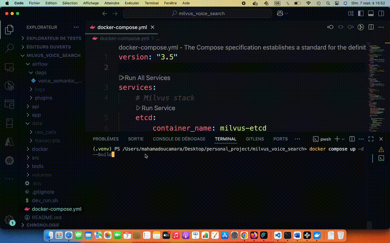

# 🎙️ Voice Search with Milvus, Airflow & FastAPI

End-to-end **semantic search pipeline for voice calls** powered by **ASR (speech-to-text), embeddings, vector search, orchestration, and a UI**.

Imagine a customer service team searching thousands of recorded calls:

-   “Find calls where customers asked for: a coffee machine hasn’t arrived yet.”
-   “Show me complaints about a leaking machine.”

This project demonstrates how a Data Engineer can design, orchestrate, and expose such a pipeline.

---

## 🏗️ Architecture


-   **Postgres** → Stores transcripts & metadata (`calls` table).
-   **Milvus** → Stores high-dimensional embeddings (`call_embeddings` collection).
-   **Airflow** → Orchestrates ETL: audio → transcript → embedding → store.
-   **FastAPI** → Provides `/search` endpoint (embed query → Milvus → Postgres metadata).
-   **Streamlit** → Lightweight UI for non-technical users.

---

## 📁 Project Structure

```
├── airflow/          # dags/, logs/, plugins/
├── api/              # FastAPI service (Files: Dockerfile, main.py, requirements.txt)
├── app/              # Streamlit UI (.streamlit/secrets.toml) + Service (Files: Dockerfile, ui.py, requirements.txt)
├── data/             # raw_calls/audio .wav files (ignored in git)
├── docker/           # Airflow service (Dockerfiles) init.sql
├── docs/
├── src/              # asr.py, embed.py, store.py, schemas.py, search_milvus.py
├── tests/
├── volumes/          # persisted DB + Milvus state(ignored in git)
├── dev_run.sh
├── docker-compose.yml
├── requirements.txt
└── README.md
```

---

## ⚠️ Notes

-   `.gitignore` excludes sensitive/local state:
    -   `airflow/logs`, `airflow/plugins`
    -   `.streamlit/` (with `secrets.toml`)
    -   `volumes/` (Postgres/Milvus data)
    -   `data/` (your audio .wav files & transcripts)

---

## 📂 Sample `.env`

A `.env` file **must exist in the project root**. Example:

```ini
# Airflow UID for permissions
AIRFLOW_UID=501

# App Postgres (calls metadata)
APP_PG_HOST=host_name
APP_PG_DB=postgres_database_name
APP_PG_USER=postgres_database_username
APP_PG_PASSWORD=your_pg_password_here

# Airflow metadata DB
AIRFLOW_DB_USER=your_airflow_user
AIRFLOW_DB_PASSWORD=your_airflow_db_password_here
AIRFLOW_DB_NAME=your_airflow_db_name

# Airflow secrets
AIRFLOW__WEBSERVER__SECRET_KEY=replace_me_with_random_hex
AIRFLOW_ADMIN_USERNAME=your_admin_username
AIRFLOW_ADMIN_PASSWORD=replace_me_with_random_hex
AIRFLOW_ADMIN_EMAIL=admin@demo.com
AIRFLOW__CORE__FERNET_KEY=replace_me_with_random_fernet_key
```

---

## 📂 Sample `app/.streamlit/secrets.toml`

```ini
API_BASE = "http://api:8000"
DB_USER = "an_username"
DB_PASS = "a_password"
```

Replace values with your own secure secrets.  
Do **not commit `.env`** it’s in `.gitignore`.
Do **not commit `secrets.toml`** it’s in `.gitignore`.

---

## 📂 Data Model

**Postgres (`calls` table):**

```sql
CREATE TABLE calls (
  call_id      BIGSERIAL PRIMARY KEY,
  external_id  VARCHAR(64),
  customer_id  VARCHAR(64),
  started_at   TIMESTAMPTZ,
  duration_sec INT,
  file_uri     TEXT,
  transcript   TEXT,
  summary      TEXT,
  sentiment    VARCHAR(16),
  created_at   TIMESTAMPTZ DEFAULT NOW()
);
```

**Milvus (`call_embeddings` collection):**

-   `call_id` → reference to Postgres
-   `vector` → 384-dim sentence embedding
-   Index: IVF_FLAT, metric=COSINE

---

## ⏳ Airflow DAGs

Main DAG: **`voice_semantic_dag`**

-   `transcribe` → Whisper ASR → transcript.
-   `embed_and_upsert` → generate embeddings, insert into Milvus + metadata into Postgres.

Hello-world DAGs included for testing:

-   `hello_world.py`
-   `test_postgres_connection.py`

---

## ⚙️ Prerequisites

-   Python **3.9+**
-   Docker & Docker Desktop

---

## Tech Stack

-   **Airflow**: ETL orchestration
-   **OpenAI Whisper**: speech-to-text transcription
-   **SentenceTransformers**: semantic embeddings (384-dim)
-   **Postgres**: structured metadata storage
-   **Milvus**: vector database for similarity search
-   **FastAPI**: lightweight API service
-   **Streamlit**: minimal UI for search + playback
-   **Docker Compose**: local orchestration

---

## Before runing the project

### You must add your audio files

Place your `.wav` audio recordings inside: data/raw_calls/
For example:
**data/raw_calls/refund_request.wav**
**data/raw_calls/delivery_delay.wav**

⚠️ These files are **not included in the repo** (they are gitignored).  
You must create or add your own audio files (.wav) locally before running the pipeline.

---

## Run the Project

**Clone the repository:**

```bash
git clone https://github.com/konomissira/milvus_voice_search.git
cd cd milvus_voice_search
```

### 1. Create a virtual environment

**macOS/Linux**

```bash
python3 -m venv .venv
source .venv/bin/activate
```

**Windows (PowerShell)**

```powershell
python -m venv .venv
.venv\Scripts\Activate.ps1
```

### 2. Install dependencies

```bash
pip install -r requirements.txt
```

### 3. Build & Start Services

```bash
docker compose up -d --build
```

Then Go to the following URL:

-   Airflow UI: http://localhost:8080
-   Streamlit UI: http://localhost:8501

---

## Trigger the ETL DAG

1.  Open Airflow at http://localhost:8080
2.  Log in using your credentials from .env file
3.  In the DAG list, find voice_semantic_dag
4.  Trigger it manually (▶ button) to process audio files in data/raw_calls/:
    this will:
    -   Transcribe audio → store transcripts in Postgres
    -   Generate embeddings → store vectors in Milvus
    -   Make calls searchable through the API + Streamlit UI

---

## How It Works



---

## License:

This project is licensed under the MIT License
